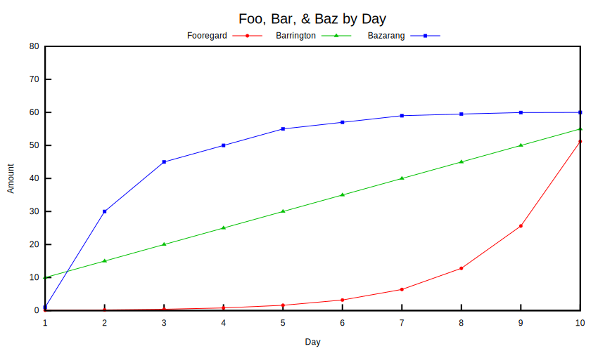

# nimgnuplot

Gnuplot interface for Nim, loosely based on pygnuplot. Uses a stateful object to accumulate commands and data, and then execute a script by using an `exec` call to a gnuplot program. It is not built for interactive mode or interactive plots, and instead assumes you'll submit a script to `gnuplot`, then receive bytes as output.

It depends on Datamancer, and features utilities for plotting `DataFrame` objects. However, there is also a generic `addData[T]()` plot for arbitrary data types; to use this, simply define `toCsvString()` on your data type. An example can be found in `examples/iris.nim`.

The environment variable `GNUPLOT_EXE` can be used to point to any `gnuplot` binary.

**Documentation:** https://nervecenter.github.io/nimgnuplot

### Example

This can be found at `examples/foobarbaz.nim`. 

```nim
import std/sugar
import std/tables
import std/strformat

import datamancer
import nimgnuplot

const
    COL_COLORS = {
        "foo": "red",
        "bar": "web-green",
        "baz": "blue",
    }.toTable

    COL_NAMES = {
        "foo": "Fooregard",
        "bar": "Barrington",
        "baz": "Bazarang",
    }.toTable

    COL_POINT_TYPES = {
        "foo": 7,
        "bar": 9,
        "baz": 5,
    }.toTable

var g = initGnuplotScript()

g.cmd """
    set terminal svg size 850,500 dynamic background rgb 'white'
    set style fill solid 1.0
    set title 'Foo, Bar, \& Baz by Day' font ',20'
    set xlabel 'Day' center
    set ylabel 'Amount' center rotate by 90
    set key at graph 0.5,1.04 horizontal center width -2
    set border lw 2
    set yrange [0:80]
    set xtics nomirror
    set ytics nomirror
"""

let colHeaders = g.addData("foobarbaz", readCsv("foobarbaz.csv"))
let plotElements = collect:
    for col in colHeaders[1 .. ^1]:
        &"u 'day':'{col}' w linespoints pt {COL_POINT_TYPES[col]} ps 0.5 lc rgb '{COL_COLORS[col]}' title '{COL_NAMES[col]}'"

g.plotData("foobarbaz", plotElements)

let svgBytes = g.execute()
writeFile("foobarbaz.svg", svgBytes)
```


